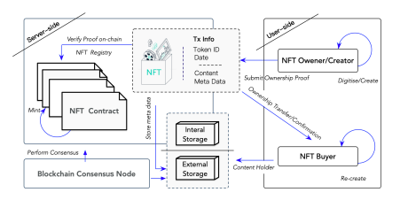

### Why are NFTs so special?

The use of non-fungible tokens (NFTs) as a solution to selling art blew up in the past year because an artist [auctioned their NFT piece](https://www.theverge.com/2021/3/11/22325054/beeple-christies-nft-sale-cost-everydays-69-million) for $69M at Christie's, giving the early adopted a nod of acknowlegement this solution has legs.  Interesting note: the white paper for Ethereum was written by a kid called Vitalik Buterin when he was 19. [^1]

A blockchain is a database that stores the record of transactions between computers. [^2]
A NFT is a unit of cryptocurrency powered by Ethereum, an open-source, decentralized blockchain that helps create and validate NFTs. 
Ethereum's currency, ETH, is used to pay for transaction fees (otherwise known as "gas fees"). [^8]

NFTs have emerged as a novel way to declare provenance over some kind of digital or physical thing at the moment –assuming the terms around it are enforceable and existing institutions shift to uphold code-as-law. The latter is what I am unsure about. 

I've come to accept the only thing you have control over as an artist is where your work goes, how it's distributed and how you market yourself. The rest of it is optics, networking and good relationships with gallerists and art administrators. Until now. Digital artists have a unique edge by using the web as a platform for play and work. Many of us in that "postnet" crowd work as graphic designers, web developers and teachers in our day jobs. We're not starving, but year on year the art practice is like a self-employed business that usually has more expenses stacking against revenue.

While embroiled under client-driven deadlines at my day job, I overheard from friends on the utter amateurism and low bar of artpieces that were selling like hot cakes on Foundation. I felt a specific excitement with "outsider artists" and amateurs being recognized for their labour. It's like DeviantArt came to life in a marketplace. I recall wanting to own special neggs on Neopets. I thought it would be a great way for artists who made gifs to gain compensation for what people usually expect to see for free on tumblr.

### Digital Art Sales Before NFTs

In previous incarnations of a "digital art market" as online marketplaces, attempts at selling digital art have been made with by [Paddle8](https://www.paddle8.com/), [Artsy](https://www.artsy.net/), [Sedition](https://www.seditionart.com/), [ArtMicroPatronage](https://artmicropatronage.org/).[^3][^4][^5] When presented with commercial opportunities, digital artists jostled to make rare or make physical their easily reproducible digital works. Previous solutions mainly moved art sales online: limit the uniqueness or rarity of artworks and create a more or less happening marketplace with A-listers and premainstream artists. Crowdfunding platforms like Drip and Patreon also took shape to support content creators. And what if your practice has intangible outputs? For performance artists and musicians, a startup called [Artery](https://artery.is/) debuted to bring creative spectacles to the public by merging venue listing and hosting with artists looking for opportunities to showcase their talent. 

The past years have seen the emergence of platforms like (OpenSea)[https://opensea.io/], [Foundation](https://foundation.app/), [SuperRare](https://superrare.com/) and [Hicetunc](https://www.hicetnunc.xyz/). These platforms purport to help artists mint and "drop" their artwork as NFTs, and also act as the marketplace for auctioning them. Peers bid on each others works sometimes to raise the relative value of each others' works, til some even deeper crypto pockets snag it up. Perfect platform-collaborative capitalism!

NFTs can be minted to attest to the existence and ownership of anything digital or physical at all: [sneakers](https://www.gq.com/story/nft-fashion-sneakers), digital character costumes, 32-pixel [penguin avatars](https://www.nft-stats.com/collection/32px-penguins), a Tiny house, a [cartoon rock](https://nypost.com/2021/08/25/someone-actually-paid-1-3m-for-an-nft-cartoon-rock/). It is more attractive than ever to try collecting rare digital things or daytrading.

### The Difference between Ethereum and Bitcoin

There are many similarities between Ethereum and Bitcoin.[^3]
Both are blockchain-based solutions to exchanging digital currency.
Both have extremely opinionated, almost cult-like communities and characters.
Both run on incentive systems that profit maintainers of the system (operators: miners, validators, developers).[^6]
Both offer the promise of a decentralized, transparent and accountable alternative to existing ways of paying for goods and services and exchanging money.

Transactions on blockchain are enabled by these consensus mechanisms [^6]:

- [Proof of work](https://ethereum.org/en/developers/docs/consensus-mechanisms/pow/): the pre-existing way that Bitcoin and Ethereum are able to maintain, validate and add new blocks to a publicly distributed ledger.
- [Proof of stake](https://ethereum.org/en/developers/docs/consensus-mechanisms/pos/): the alternative protocol to the above method. Users with a substantial amount of coin (like, 32 ETH) can stake it towards validating transactions.

PoW is computationally intensive and produces a huge carbon footprint; it's what led me to initially dismiss NFTs and mining of crypto to be [utter ecological destruction](https://www.wired.com/story/nfts-hot-effect-earth-climate/).

PoS will reduce the incentive for miners to use so much energy for mining, but seems to further the existing economic incentives underlying the maintenance of Ethereum.

As far back as 2017, computer scientists Jason Spasovski and Peter W. Eklund discovered through performance tests that increasing security through applying consensus mechanisms on blockchain also decreases scaleability.[^7]

"Fig. 1" from ["Diagram from Non-Fungible Token (NFT): Overview, Evaluation, Opportunities and Challenges (Tech Report)"](https://arxiv.org/pdf/2105.07447.pdf) by Qin Wang, Rujia Li, Qi Wang, Shiping Chen.  arXiv, Cryptography and Security (IF), May 16, 2021.

### Smart Contracts

What sets Ethereum apart from Bitcoin is its support of smart contracts during the PoW process.
The contract is a small computer program that executes the business logic attached to the sale, including the owner or recipient of the NFT.

If one of the defining features of NFTs is that it's immutable, the great part is that *supposedly* no one can go in and change the contract or tamper with the value of the asset. A huge appeal is that this information in addition to where a contract is published, who owns the collectible, what object (digital or physical) it refers to and and how much was exchanged for it will be publically displayed on the distributed ledger that is the blockchain.

There is a variable amount of risk in adopting any new mode of distribution, especially when it concerns the exchange of money. 

Every few months we hear of [stolen wallets](https://cryptopotato.com/how-i-lost-80000-worth-of-ethereum-in-2-minutes/), [missing harddrives](https://www.cbc.ca/news/canada/nova-scotia/quadriga-mystery-deepens-with-little-evidence-of-cold-wallets-containing-250m-1.5011573) of digital currency, [ICO scams](https://nakedsecurity.sophos.com/2020/06/18/crypto-founder-admits-25-million-ico-backed-by-celebrities-was-a-scam/), [insider trading](https://www.artnews.com/art-news/news/insider-trading-nft-marketplaces-regulation-1234604209/), double-spending attacks... the list goes on. Crypto is a tremendously insecure space if you don't do your own research on the correct wallets and measures to take while creating and deploying a smart contract.

What is the potential for recovering from error or vulnerability if a smart contract isn't written well in code? 
The Consensys best practice guide for developing smart contracts preaches 100% test coverage prior to contract rollout.[^9] What if by dint of human error, you, impeccable coder, forget to cover an edge case, allowed weak typing or made a function public when it should have been private? You can roll out an update, but the damage would already have been done if the smart contract has been published.

#### Footnotes

[^1] Morgan Peck. ["The Uncanny Mind That Built Ethereum"](https://www.wired.com/2016/06/the-uncanny-mind-that-built-ethereum/) Mar. 13, 2016.

[^2] Ethereum. ["How NFTs Work"](https://ethereum.org/en/nft/#how-nfts-work), 2021.

[^3] People who followed this for longer would jump to say the first big heyday around rare unique collectibles was [Cryptokitties](https://www.cryptokitties.co/) and [CryptoPunks](https://github.com/larvalabs/cryptopunks). Others would trace the idea back to the discussion of [uniquely colored cryptocoins](https://www.coindesk.com/markets/2013/06/14/colored-coins-paint-sophisticated-future-for-bitcoin/) in 2013. Might I add, Kevin McCoy and Anil Dash came out with a [proof-of-concept]() for blockchain tokenized art at Rhizome's Seven on Seven in 2014.

If you're curious to see long and boring history of selling digital art from the 90s to Nougties, it's published [here](https://books.google.ca/books?id=a4-kDwAAQBAJ&pg=PA111&lpg=PA111&dq=%22the+commodification+of+net+art%22+jennifer+chan&source=bl&ots=VK3-cVe-1k&sig=ACfU3U0qhSRvwz8s71bk6zLC1fauUENiJg&hl=en&sa=X&ved=2ahUKEwj3l-Wp_JzzAhW5MVkFHbCbDzMQ6AF6BAgLEAM#v=onepage&q=%22the%20commodification%20of%20net%20art%22%20jennifer%20chan), [here](http://www.linkartcenter.eu/public/editions/Mary_Meixner_ed_mm_netart_Link_Editions_2019.pdf), and [here](https://www.academia.edu/2541835/From_Browser_to_Gallery_and_Back_The_Commodification_of_Net_Art_1990-2010) with [slides here](https://www.slideshare.net/jenninat0r/the-commodification-of-net-art).

Art historians and curators: rest assured I am not your competition. I don't write papers anymore.

[^4] Michael Connor. ["Before the Boom"](https://rhizome.org/editorial/2021/mar/12/before-the-boom/) Rhizome. Mar. 12 2021

[^5] Funny enough, paddle8 [filed for bankruptcy](https://news.artnet.com/art-world/paddle8-bankruptcy-1806951) last year. 
Personal anecdote: One time a collector threatened me to lower a price by saying a work that didn't previously sell no paddle8 now has a "black spot" to it.

[^6] Sakoshi Nakamoto. ["Bitcoin: A Peer-to-Peer Electronic Cash System"](https://nakamotoinstitute.org/bitcoin/), 2008.
Nakamoto's definition is probably the most popular in creating and deriving the system of incentives around maintaining an open and transparent decentralized financial network.

[^7] Jason Spasovski and Peter W. Eklund. ["Proof of Stake Blockchain: Performance and Scalability for Groupware Communications"](https://www.researchgate.net/publication/320020915_Proof_of_Stake_Blockchain_Performance_and_Scalability_for_Groupware_Communications) The 9th International Conference on Management of Digital EcoSystems (MEDES'17). Bangkok, Thailand.

[^8] Ibid. 2017.
ConsenSys. ["Just Enough Bitcoin for Ethereum"](https://media.consensys.net/time-sure-does-fly-ed4518792679), 2021.

[^9] ConsenSys Diligence. "Contract Rollout", [Ethereum Smart Contract Best Practices](https://consensys.github.io/smart-contract-best-practices/software_engineering/#contract-rollout). 2021

