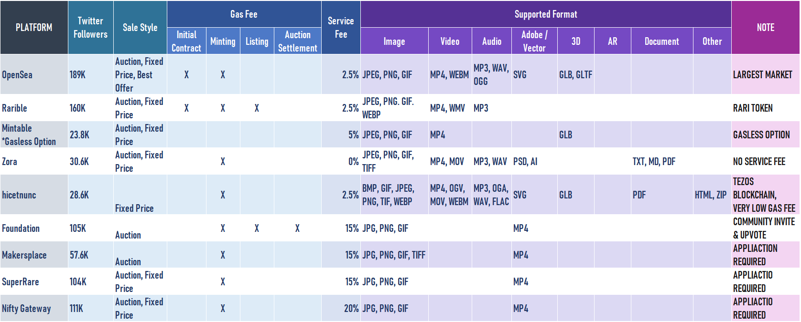
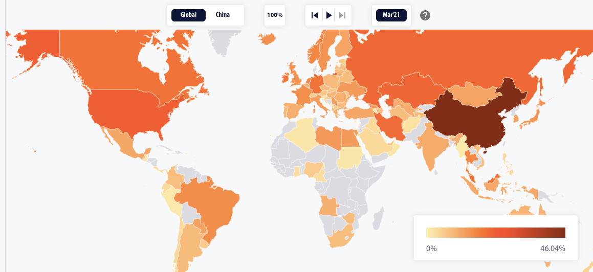
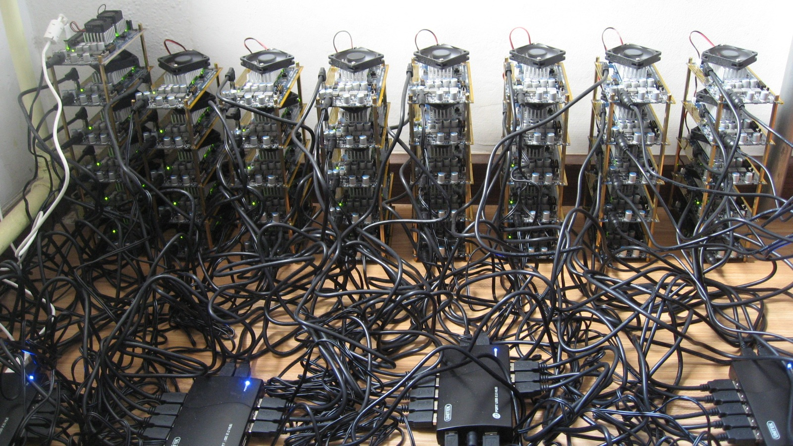
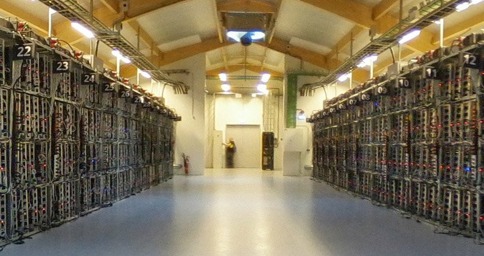

<iframe src="https://giphy.com/embed/CEiWNPgokqc9CQTh67" width="480" height="320" frameBorder="0" class="giphy-embed" allowFullScreen></iframe>

Here are some things I've heard people gripe about with regards to NFTs.

## Paying to Play

Critiques that NFT business models [mirror those of multi-level marketing (MLM) companies](https://every.to/napkin-math/nft-projects-are-just-mlms-for-tech-elites) seem to miss the point that the strategy for any early stage or beta tech product geared at a community would use an invitation-based model to onboard users.

But users do have to buy ETH to mint or buy NFTs, or to bid on NFTs on decentralized apps. A mass of artists and daytime collectors jumping onto the NFT train will only serves to raise the value of ethereum and drive up gas prices (transaction fees for using the Ethereum network to mint NFTs, mine coin or transfer currency). This in turns requires artists or whoever is purchasing to pay more. It's human nature to want to pay as little as possible and still be able to benefit from a service. 

Any service should have fees and charges tied to operations and overhead, ultimately who gains from the entire system?

From ["A Complete Comparison Of Major NFT Marketplaces – Fees, Features, Functions And Market Sizes"](https://nftartexhibition.net/blog/2021/09/14/the-latest-comparison-of-major-nft-marketplaces/), NFT ART Exhibition, Sep 14, 2021

## Misaligned Incentives

  "...the first transaction in a block is a special transaction that starts a new coin owned
  by the creator of the block. This adds an incentive for nodes to support the network, and
  provides a way to initially distribute coins into circulation, since there is no central authority to issue them. The steady addition of a constant of amount of new coins is analogous to gold miners expending resources to add gold to circulation. In our case, it is CPU time and electricity that is expended."
Satoshi Nakamoto, ["Bitcoin: A Peer to Peer Cash System"](http://satoshinakamoto.me/bitcoin.pdf). 2008

Imagine systematically trying every combination you can think of to crack a friend's Facebook password. Mining involves multiple computers competing to find a single-use "passphrase" ([nonce](https://dwan.org/index.php/2017/06/13/proof-of-work-and-the-nonce/)) at the same time. However, only one computer will win and the rest just have to give up despite expending all the energy to find the correct answer. (That's where the waste of energy comes from). The one that solves the answer gets to produce the next block on the chain and is rewarded with eth for doing so. (Don't forget that every block on the chain needs to be updated after a block is added or a smart contract is run... thus requiring more energy and time.) 

Cambridge Bitcoin Electricity Consumption Index. ["Mining Map"](https://cbeci.org/mining_map) March 2021

Bitcoin and Ethereum are systems designed to reward its maintainers: the miners... or more often, the owners of mining pool companies.[^1] Miners can "pool" their computational energy together to increase the chances of finding a proof-of-work and adding a new block. In fact if the original purpose of bitcoin was to give any user -[smartass college included](https://qz.com/1160667/the-secret-lives-of-students-who-mine-cryptocurrency-in-their-dorm-rooms/)- a chance of using their own computers to "passively" generate income through mining (and eventually validating), the computational and energy needs are so immense that roughly 65-70% of the world's mining activity occurs in data centers in China since 2017.[^2] It's likely this industry has relocated to the US since the crackdown on mining transactions by the Peoples Bank of China in advance of debuting its own central bank digital currency (CBDC).[^3]

A questionable crypto-mining rig

Inside Genesis, the self-proclaimed largest cryptomining facility in Iceland

From a governance perspective, the feature of [decentralized autonomous organizations](https://www.investopedia.com/tech/what-dao/) (DAOs) that underline digital currencies allows currency owners to vote on the direction of coin development, decide how organization rewards are spent. It is in practice, much more non-hierarchical than interacting with a top-down institution like a bank. However, the accretion of membership within mining pools can give these groups more political power to deterimine the course of ethereum than individual users, thus setting up differing classes of citizenship in the community.

## Many NFTs are "locked in" on the blockchain they were created on

Most NFTs are currently not interoperable between different blockchains, even though they can be transferred between wallets, and their existence and sales paid for with eth.[^4] This runs counter to the idea of NFTs as interchangeable assets within a defi ecosystem. Longterm, this could be viewed as a risk in the same way you aren't able to trade one chain's item for the value of another, leading to isolated community-markets. A tangible example of this on decentralized app platforms would be the inability to use CrytoPunk in a CrytpoKitties game. [^5] On the token level, an example would be the way Hicetunc tokens that exist on the Tezos blockchain, wasn't interoperable with Open Sea until recently. This is an issue that NFT marketplaces seem to be working fast to overcome, however.

## Burning physical artworks in attempt to increase the value of NFT art

In March 2021, Injective Protocol (a Defi trading company) who bought a $95,000 Banksy recorded its burning as it was converted to a NFT, in great gesture to make the NFT the only thing representing the artwork in digital form.[^6]

This isn't an inherent problem of the technology, this is moreso a problem of how humans are responding to new tech: destruction of culture for the sake of making headlines.

## Burning NFTs to increase the value of a certain cryptocurrency

Within the crypto space, coin or token burning is done as a deflationary measure, to preserve or raise the scarcity of the NFT or the underlying currency powering the addition to a blockchain. [^7] Burning is a feature that would need to be written into a smart contract program. It would be made available by a function that would remove the token from the blockchain. 

In 2017, Mitchell Chan released "Digital Zones of Immaterial Pictorial Sensibility", a project that copies of works of fine art and would also allow the owner of the NFT to use a smart contract function he included to burn the NFT representing the artwork. Apparently the work is based on Yves Klein's work. (To his credit, the project was launched a couple months before CryptoKitties, which deserves some kind of applaud for "first dibs" on the idea.) [^8]

This happens on the market, and ironically, in art too.

## Just because you mint, does not mean you will sell

There is no magical connection between creating NFT and art sales. Not every gets to be Beeple. But you might stand a good chance if you have the influence and outreach and sponsorship of a community to match its value. In particular, Karen Darricades of Creative Commons Canada observes that artists with a higher social media follower count tend to succeed with NFT sales.[^9] In attempt to qualify the value of NFT art for buyers, [Haug and Partners](https://www.haugpartners.com/article/valuation-of-nfts-factors-to-consider-and-an-alternative-to-destroying-the-original-work/) mention the way an artists' pre-mainstream or A-List status also informs the valuation of their artwork.[^10] 

As much as we hear of the successes of cartoon rocks and avatar costume parts being sold, similarly pages and pages of tokenized art sit unsold or sell for way lower than the existing art market would pay for it.[^11][^12] At the end of the day, a sales marketplace makes sales less about art but the speculative value of an artist and how they've chosen to monetize their work. 

## The existence of a NFT does not ensure authentic authorship by an artist

Some tech firms have proposed NFTs unlock a use case for identity verification. On the other hand, platforms like OpenSea, Rarible and Marbl don't enforce identity verfication when an artwork is minted, other than through the use of social media handles. This leaves artists vulnerable to people minting their work and selling it for profit.[^14]

#### Footnotes

[^1] David Schwartz. "The Best Incentive is No Incentive" Stanford University https://www.youtube.com/watch?v=lP63dTY_7j0&t=0s The Stanford Blockchain Conference 2020. Arrillaga Alumni Center, Stanford University. Feb. 19-21, 2020

[^2] "Comparison of mining pools" https://en.bitcoin.it/wiki/Comparison_of_mining_pools

[^3] More on this very recent crackdown in the sources below:

David Thomas. ["Huobi Exchange Stops Accepting Chinese Users After Crypto Crackdown"](https://beincrypto.com/huobi-exchange-stops-accepting-chinese-users-after-crypto-crackdown/), beincrypto, Sep 24. 2021

Roger Huang. Forbes. ["The ‘Chinese Mining Centralization’ Of Bitcoin And Ethereum"](https://www.forbes.com/sites/rogerhuang/2021/12/29/the-chinese-mining-centralization-of-bitcoin-and-ethereum/?sh=64f88b4e2f66) Dec 29, 2020.

CNBC. ["China's Bitcoin Miner Exodus"](https://www.cnbc.com/2021/06/15/chinas-bitcoin-miner-exodus-.html) Jun. 15, 2021

MacKenzie Sigalos. ["How the U.S. became the world’s new bitcoin mining hub"](https://www.cnbc.com/2021/07/17/bitcoin-miners-moving-to-us-carbon-footprint.html), CNBC. Jul. 17, 2021

[^4] Isabelle Lee. ["The NFT space is booming again, but experts say there are 5 challenges the digital collectibles space still needs to overcome"](https://markets.businessinsider.com/news/currencies/nft-outlook-challenges-accessibility-storage-interoperability-mainstream-non-fungible-token-2021-8) Business Insider. Aug. 8, 2021

[^5] Ollie Leech. ["What Are NFTs and How Do They Work?"](https://www.coindesk.com/tech/2021/02/01/what-are-nfts-and-how-do-they-work/) CoinDesk. Feb 1, 2021.

[^6] Brian Boucher. ["A Group of Financial Traders Torched a $95,000 Banksy on Camera to Transform It Into a (Maybe) More Valuable NFT Artwork"](https://news.artnet.com/art-world/financial-traders-burned-banksy-nft-1948855), ArtNet. Mar. 4, 2021

[^7] Nathan Reif. ["Cryptocurrency 'Burning': Can It Manage Inflation?"](https://www.investopedia.com/tech/cryptocurrency-burning-can-it-manage-inflation/) Nov 24, 2020

[^8] Pierre Paslier. ["My Dealbreakers for NFTs"](https://www.generativehut.com/post/__nft) Mar 8, 2021.

[^9] Karen Darricades. ["Arts and Culture, Creative Commons and NFTs : why it’s going to take more than a unique token to solve the unique problems faced by arts and culture producers"](https://ca.creativecommons.net/2021/08/09/arts-and-culture-creative-commons-and-nfts-why-its-going-to-take-more-than-a-unique-token-to-solve-the-unique-problems-faced-by-arts-and-culture-producers/) Aug. 9, 2021.

[^10] Haug and Partners. ["Valuation of NFTs: Factors to Consider and an Alternative to Destroying the Original Work"](https://www.haugpartners.com/article/valuation-of-nfts-factors-to-consider-and-an-alternative-to-destroying-the-original-work/) July 28, 2021.

[^11] Abby Ohlheiserarchive. ["Some artists found a lifeline selling NFTs. Others worry it’s a trap."](https://www.technologyreview.com/2021/03/25/1021215/nft-artists-scams-profit-environment-blockchain/) MIT Technology Review. Mar 25, 2021

[^12] Bijan Stephen. ["NFT MANIA IS HERE, AND SO ARE THE SCAMMERS"](https://www.theverge.com/2021/3/20/22334527/nft-scams-artists-opensea-rarible-marble-cards-fraud-art) Mar 20, 2021
