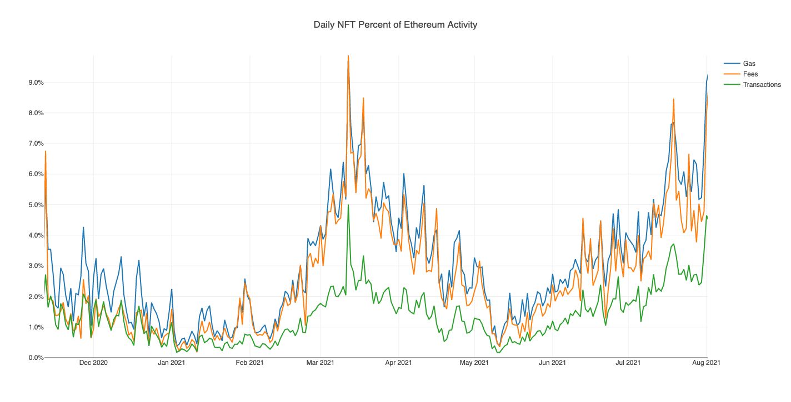
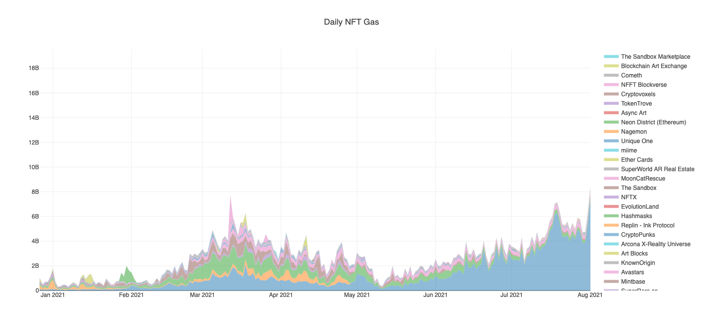

We want our art and passion work to be morally hygienic, the meat we eat to have happily died for us. In response to the outcry that proof-of-work NFT activity contributes to exorbitant carbon emissions, platforms like NiftyGateway, Superrare and Zora have conceded to carbon offsetting. [^1][^3] Hicetunc famously uses the proof-of-stake process on Teva blockchain to mint "clean NFTs". 

There has been a lot written about the environmental impact so I won't belabor it. [^2]

Kyle McDonald's project, ["ethereum-nft-activity"](https://github.com/kylemcdonald/ethereum-nft-activity) uses Python scripts to pull transaction data from popular NFT art platforms and makes estimations of daily carbon output according to Ethereum activity across 75  popular NFT art platforms. A separate [repo](https://github.com/kylemcdonald/ethereum-energy) contains the scripts for using benchmarks of GPU power to find the per-day energy consumption of Ethereum. 

McDonald admits there may be a high margin of error between the intensities of mining pool companies, but what I find most fascinating is the rising amount of fees as part of NFT transactions over time. 

 

Visualization from [Ethereum NFT Activity](https://kylemcdonald.github.io/ethereum-nft-activity/) By Kyle McDonald [@kmimc](https://twitter.com/kcimc), 2021

Counterarguments to ecological critiques include:

- People are focusing and scapegoating NFT-minting for emissions because there's data around it, but there's a lack of data around the art world's comparative carbon emissions to make an accurate comparison. [^3]
- NFTs only account for a small portion of Ethereum's activity, and using NFTs to mint art is simply just one aspect of a larger ecosystem that consumes much more energy [^3][^4]
- There's no direct correlation between increased transaction activity and carbon output [^4]
- Regardless of the number of transactions, the net output of the carbon emissions remains the same due to existing energy overhead of running the infrastructure anyway. [^4] 
(I find this final reason to be similar to arguing that meat is already factory-farmed, so vegetarians don't make any impact by choosing not to consume it.)

The cognitive dissonance of our changing world has never been stronger and carbon offsetting begs the question of whether the ends justifies the means. (This is also not to make light of our general gig-working artist who has 2 or 3 precarious jobs, most of which have been made redundant by Covid. I do have friends who paid rent by cashing out bitcoin and eth at some point.)

What I find hard to determine at the moment is how remediation and renewal from applying offsets fares against the net harm we do to the environment. Looked at closely, efforts like carbon capturing and reforestation require time, environmental planning and maintenance and to succeed.[^5] [^6] [^7]

[^1] Shanti Escalante-De Mattei. ["Should You Worry About the Environmental Impact of Your NFTs?"](https://www.artnews.com/art-news/news/nft-carbon-environmental-impact-1234589742/) ArtNews. Apr. 14, 2021

Some of the many sources of ecological critique of using proof-of-work to mine Ethereum:

besancia. ["The Ecological Impact of NFTs"](https://nonfungible.com/blog/ecological-impact-nfts#!, NonFungible, Mar, 13 2021

Justine Calma. ["THE CLIMATE CONTROVERSY SWIRLING AROUND NFTS"](https://www.theverge.com/2021/3/15/22328203/nft-cryptoart-ethereum-blockchain-climate-change) The Verge. Mar. 15, 2021.

"CryptoArt.wtf" http://cryptoart.wtf/, Mar. 12 2021

[^3] 
 "Ironically, because blockchains give the world such a transparent and accurate accounting of the energy consumption of our industry, they provide a tangible number to focus and dwell on, which has led to a double standard being applied to our industry. Because there is no blockchain to account for the carbon footprint of the traditional art world, which includes, inter alia, all of the private and commercial air travel to the Basels, Biennales, and countless other festivals around the world, not to mention the automobile traffic to gallery exhibitions, museums, and so forth, such criticism has not been leveled against the offline art world, despite the fact that its carbon footprint is orders of magnitude greater." 

Duncan & Griffin Cock Foster. ["Nifty Gateway to Become Carbon Negative"](https://www.gemini.com/blog/nifty-gateway-to-become-carbon-negative), Mar 29, 2021.

[^4] SuperRare Labs Team. ["No, CryptoArtists Aren’t Harming the Planet"](https://medium.com/superrare/no-cryptoartists-arent-harming-the-planet-43182f72fc61), Medium, Mar. 2, 2021

[^5] Inogen Alliance. ["Decarbonization Series Part 3: The Pros and Cons of Carbon Offsets"](https://newsdirect.com/news/decarbonization-series-part-3-the-pros-and-cons-of-carbon-offsets-120297895) News Direct. Jul. 8, 2021

[^6] Valentina Di Liscia. ["Does Carbon Offsetting Really Address the NFT Ecological Dilemma?"](https://hyperallergic.com/634236/does-carbon-offsetting-really-address-the-nft-ecological-dilemma/) Hyperallergic. Apr. 5, 2021

[^7] Jennifer Van Evra. ["Carbon offsets might be a dangerous distraction from more effective climate action, experts say"](https://www.cbc.ca/radio/whatonearth/carbon-offsets-might-be-a-dangerous-distraction-from-more-effective-climate-action-experts-say-1.5946764) CBC, Mar 12, 2021.

